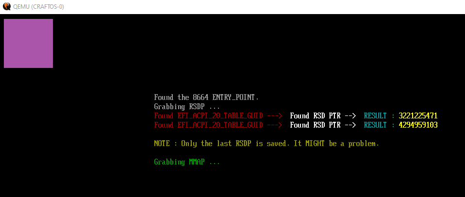

# CRASHOS EFI Bootloader  
  
**NOTES**  
    This is the source code to the EFI Bootloader youtube series.  
	**YOUTUBE :** https://www.youtube.com/watch?v=4CxOYxCjKDM&list=PLwH94sFU_ljN4ENYWT14e1oLRUKwAZVtp  
	
    Use this link to grab the code needed to create the drive.hdd file.  
    https://github.com/CraftingInC/UEFI-GPT-image-creator  
  
  
  
**STATUS**  
    This code is setup for the loader / kernel to begin it's development. RSDP has been added to access hardware. The GDT is called from within the EFI file itself, AFTER the Exit Boot Services has been called. Possible youtube video series for the loader / kernel in the future.  
  
  
  
**WARNING**  
    I take no responsibility of what you do with this code. You use the code at your own risk. You have been warned !  
	

  
	
	