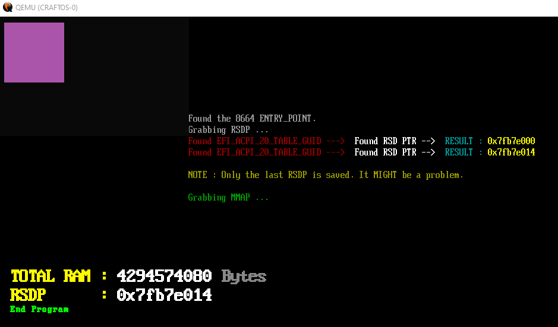

# CRASHOS EFI Bootloader  
  
**NOTES**  
Use this link to grab the code needed to create the drive.hdd file.  
https://github.com/CraftingInC/UEFI-GPT-image-creator  
  
  
  
**STATUS**  
This code is setup for a loader / kernel to begin it's development. RSDP has been added to access hardware. The GDT is called from within the EFI file itself, AFTER the Exit Boot Services has been called.  
   
I have tested this on QEMU, VirtualBox and on my physical laptop. Works exactly the same on all three.  
  
  
  
**WARNING**  
    I take no responsibility of what you do with this code. You use the code at your own risk. You have been warned !  
	

  
	
	
